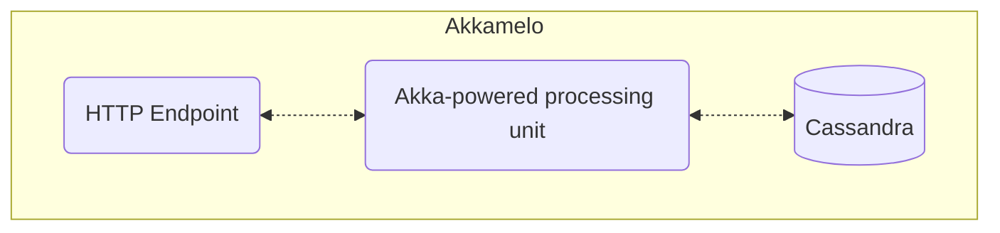

# Akkamelo: A Resilient, FastAPI in Scala with Akka

**Akkamelo** is a learning project aimed at building a resilient API using Scala and Akka. The project is based on the concepts of concurrency, fault-tolerance, and scalability. Initially inspired by the backend challenge "Rinha de Backend", this API focuses on managing credits and debits in a multi-client environment while ensuring data consistency.

## Project Overview

The main goals of this project include:

- **Concurrency**: Handle multiple concurrent transactions while maintaining consistency.
- **Resilience**: Create an API capable of withstanding failures and errors without compromising functionality and speed.
- **Speed**: Ensure low-latency responses by optimizing request handling and minimizing processing time, even under high load.
- **Concurrency Management**: Enforce credit and debit rules, ensuring that debits cannot result in negative balances beyond predefined limits.

## Architecture

The system consists of multiple components, including:

- **API Service**: An instance of the API service handles client requests.
- **Database**: A Cassandra database for storing client data, transactions, and balance information.

## Functional Requirements 

[Here](./docs/STATUS-TESTES.md).

## Technologies Used

- **Scala**: The main programming language used to build the API.
- **Akka**: A toolkit for building highly concurrent, distributed, and resilient message-driven systems.
- **Docker**: Used for containerization and ensuring consistent environments.
- **Database**: Cassandra

